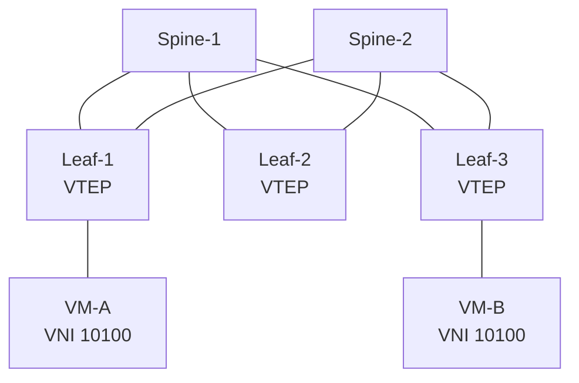

ตอนแรกที่อ่านเรื่อง VXLAN ผมพยายามจำว่ามันคือ *"MAC-in-UDP encapsulation ที่มี VNI ขนาด 24 bit"* ซึ่งจำได้ แต่ไม่เข้าใจ จนกลับไปตั้งคำถามใหม่ว่า **มันเกิดมาเพื่อแก้ปัญหาอะไร** แล้วทุกอย่างถึงเข้าที่


## ปัญหาที่ VLAN แบบเดิมแก้ไม่ได้

ก่อนจะเข้าใจว่า VXLAN ดียังไง ต้องเห็นก่อนว่าของเดิมมันติดตรงไหน


| ข้อจำกัด | ผลที่ตามมา |
| ---------------------------- | -------------------------------------------- |
| VLAN ID มีแค่ 12 bit | ได้ 4,094 segment — ไม่พอสำหรับ multi-tenant |
| Spanning Tree บล็อกลิงก์ทิ้ง | ซื้อ bandwidth มาแต่ใช้ได้ไม่หมด |
| L2 domain ยืดไม่ถึง | ย้าย VM ข้าม rack ไม่ได้ |



**แก่นของเรื่อง:** VXLAN ไม่ได้มาแทน VLAN แต่ **ห่อ L2 frame ไว้ใน UDP** แล้วส่งข้าม L3 network — ทำให้ underlay เป็น routed network ที่ใช้ได้ทุกลิงก์เต็มที่ ส่วน overlay ยังเห็นเป็น L2 เหมือนเดิม


## ภาพรวม spine-leaf fabric



VM-A กับ VM-B คุยกันเหมือนอยู่ VLAN เดียวกัน ทั้งที่จริงๆ แล้ว traffic วิ่งข้าม L3 fabric — **นี่คือสิ่งที่ overlay ทำให้เกิดขึ้น**

ภาพข้างบนเขียนด้วย [Mermaid](https://mermaid.js.org/) ไม่กี่บรรทัด ไม่ต้องเปิด Visio และแก้ทีหลังได้ทันที

## ตัวอย่าง config บน Nexus

```text {filename="nx-os"}
! สร้าง VNI และผูกกับ VLAN
vlan 100
  vn-segment 10100

! NVE interface = ตัวห่อ/แกะ VXLAN
interface nve1
  source-interface loopback0
  host-reachability protocol bgp    ! <- ตรงนี้คือ EVPN
  member vni 10100
    ingress-replication protocol bgp
```

บรรทัด `host-reachability protocol bgp` คือจุดตัดสำคัญ ถ้าไม่มีบรรทัดนี้ก็เป็น VXLAN แบบ flood-and-learn ซึ่งพาไปสู่หัวข้อถัดไป

## แล้ว EVPN มาทำอะไร

VXLAN เพียวๆ ใช้ **flood-and-learn** — VTEP ไม่รู้ว่า MAC ไหนอยู่ที่ VTEP ตัวไหน ต้อง flood ไปถามทุกคน เปลืองและ scale ไม่ขึ้น

**EVPN** คือการเอา MP-BGP มาเป็น control plane ให้ VTEP ประกาศ MAC/IP ที่ตัวเองรู้จักให้เพื่อนฟัง


**เทียบให้เห็นภาพ**

flood-and-learn = ตะโกนถามทั้งห้องว่าใครชื่อนี้บ้าง

EVPN = มีสมุดรายชื่อกลางที่ทุกคนช่วยกันอัปเดต


ความต่างจริงๆ คือ **ย้ายจาก data plane learning ไปเป็น control plane learning** ซึ่งเป็นหลักการเดียวกับที่ routing protocol ทำมาตลอด แค่เอามาใช้กับ MAC address

## สิ่งที่ยังต้องไปอ่านต่อ


ส่วนนี้ผมยังไม่เข้าใจดีพอที่จะเขียนสรุป จดไว้กันลืม


- EVPN Route Type 2 กับ Type 5 ต่างกันตรงไหน ใช้ตอนไหน
- Anycast Gateway ทำให้ VM ย้าย rack ได้โดยไม่เปลี่ยน default gateway ยังไง
- Multi-Site กับ Multi-Pod ต่างกันยังไงในบริบท ACI

## อ้างอิง

- [RFC 7348 — Virtual eXtensible Local Area Network (VXLAN)](https://datatracker.ietf.org/doc/html/rfc7348)
- [RFC 8365 — A Network Virtualization Overlay Solution Using EVPN](https://datatracker.ietf.org/doc/html/rfc8365)

